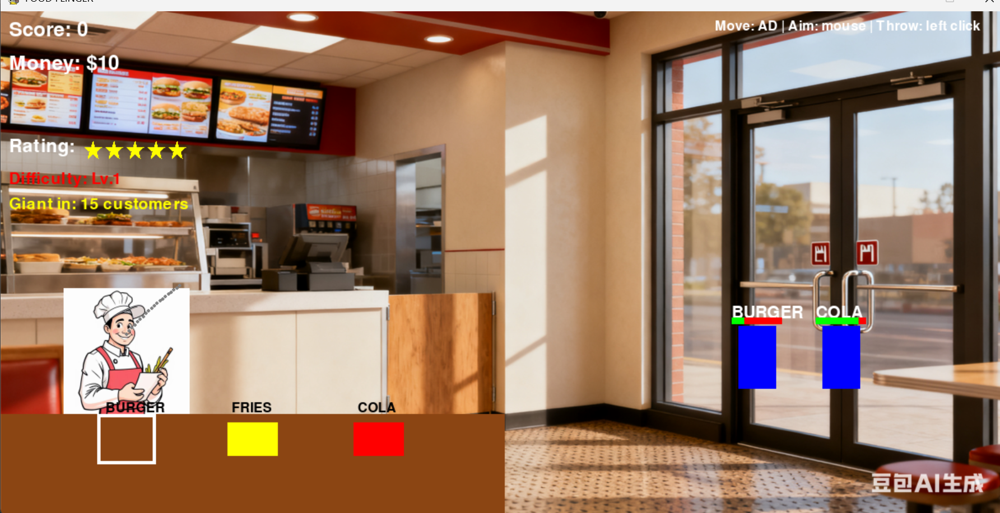

# Food Flinger

A fast-paced 2D restaurant management game where you throw food to hungry customers! Built with Pygame.

## Gameplay

- **Move**: Use A and D keys to switch between food stations
- **Aim**: Use mouse to aim at customers
- **Throw**: Left click to launch food to customers

## Game Objective

Serve customers the food they want before they lose patience! Each successful delivery earns you money and score points. But be careful - running out of money or getting too many bad reviews will close your shop!

## Game Mechanics

### Basic Systems
- **Three Food Types**: Burger, Fries, and Cola
- **Physics-Based Throwing**: Realistic projectile motion with gravity
- **Customer Patience**: Customers will leave angry if you take too long
- **Shop Rating**: Maintain a 5-star rating system
  - Gain +0.5 stars for every 3 successful deliveries
  - Lose -0.5 stars when customers leave angry
  - Game over at 0 stars!
  

### Economy System
- **Starting Money**: $10
- **Food Cost**: -$3 per throw
- **Customer Payment**: +$5 per successful delivery
- **Bankruptcy**: Game over if money drops below $0

### Combo System
- Build combos by serving customers quickly
- Combo multiplier boosts your score (not money)
- 3 seconds to maintain combo - miss and it resets!
# Food Flinger

A fast-paced 2D restaurant management game where you throw food to hungry customers! Built with Pygame.

## Gameplay

- **Move**: Use A and D keys to switch between food stations
- **Aim**: Use mouse to aim at customers
- **Throw**: Left click to launch food to customers

### Game Scene

<p align="center">
  
</p>

## Game Objective

Serve customers the food they want before they lose patience! Each successful delivery earns you money and score points. But be careful - running out of money or getting too many bad reviews will close your shop!

## Game Mechanics

### Basic Systems
- **Three Food Types**: Burger, Fries, and Cola
- **Physics-Based Throwing**: Realistic projectile motion with gravity
- **Customer Patience**: Customers will leave angry if you take too long
- **Shop Rating**: Maintain a 5-star rating system
  - Gain +0.5 stars for every 3 successful deliveries
  - Lose -0.5 stars when customers leave angry
  - Game over at 0 stars!
  


### Economy System
- **Starting Money**: $10
- **Food Cost**: -$3 per throw
- **Customer Payment**: +$5 per successful delivery
- **Bankruptcy**: Game over if money drops below $0

### Combo System
- Build combos by serving customers quickly
- Combo multiplier boosts your score (not money)
- 3 seconds to maintain combo - miss and it resets!
- Track your highest combo streak

### Difficulty Scaling
- Difficulty increases every 10 customers served
- Customers spawn faster and have less patience
- Challenge yourself to see how long you can survive!

### Giant Customer Bonus
- Every 15 customers, a Giant Customer appears!
- Giants require 10 correct food items
- Each correct item: +20 score, +$5
- Complete bonus: +$50
- Normal customers pause during giant events

## Installation and Running

1. Install Python 3.7+
2. Install dependencies:
   ```
   pip install -r requirements.txt
   ```
3. Run the game:
   ```
   python main.py
   ```

## Game Features

- **Combo System**: Chain successful deliveries for higher scores
- **Difficulty Progression**: Game gets harder as you serve more customers
- **Shop Rating**: 5-star rating system with game-over at 0 stars
- **Economy Management**: Balance costs and earnings to avoid bankruptcy
- **Giant Customer Events**: Special bonus rounds with big rewards
- **High Score Tracking**: Persistent high score saved to file
- **Visual Effects**: Money bills, angry emojis, and score popups
- **Multiple Failure States**: Bankruptcy or bad reviews end the game

## Controls

- **A/D**: Move between food stations (Burger, Fries, Cola)
- **Mouse**: Aim at customers
- **Left Click**: Throw food
- **ESC**: Exit game over screen

## Technical Implementation

- Built with Pygame library
- Object-oriented game architecture
- Persistent data storage (high scores)
- Collision detection system
- Particle effect system
- Dynamic difficulty scaling
- State management for game flow

